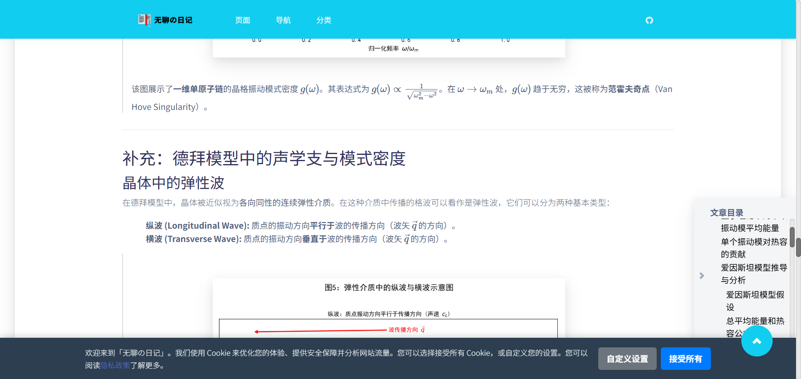
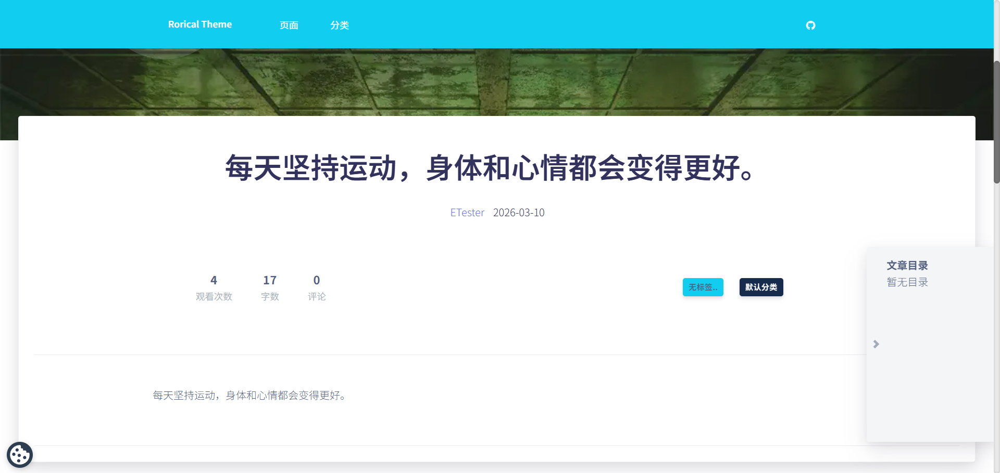

# 🌸 Rorical Theme for Typecho

> 简洁 · 可爱 · 功能强大
>
> 一款为 Typecho 打造的现代化卡片式主题。基于 Argon 设计，并且重构了系统的功能函数以及运行逻辑，支持无插件依赖的阅读统计以及 Cookie 管理器。

[](https://github.com/little-gt/THEME-RoricalTheme/) [](https://www.gnu.org/licenses/gpl-3.0.html) [](https://demos.creative-tim.com/argon-design-system/)

主题预览：






参与讨论：

[Typecho 官方论坛主题帖](https://forum.typecho.org/viewtopic.php?t=25572)

---

## ✨ 特点概览

| 功能模块 | 说明 |
| :-- | :-- |
| **轻快交互** | PowerMode 打字特效、鼠标点击涟漪、AJAX 评论与搜索 |
| **文章增强** | 自动 TOC 目录、阅读统计、字数统计、评论计数 |
| **兼容优化** | 完全支持 Typecho 1.2.1-1.3.0 / PHP 7.4-8.3 / MySQL 8.X-9.X |
| **高度自定义** | 独立页面图标与配色、自定义导航栏样式、双端背景、LOGO 设置 |
| **现代化设计** | 基于 Argon Design System 与 Bootstrap 4，响应式支持多端展示 |
| **归属地展示** | 评论区 IP 归属展示（依赖 [XQLocation](https://www.toubiec.cn/1194.html)） |
| **Cookie合规** | 支持 GDPR/最新2026年执行的中国网络安全规范的 Cookie 同意模式 |
| **评论管理** | 扁平化评论结构、回复提及功能、未登录用户权限控制 |
| **隐私政策** | 支持自定义隐私政策页面 URL |

---

## 🚀 近期更新

### 🛠️ 功能与性能优化
- 修复了一些已知问题，优化了一些功能；
- 修复了因为CDN资源变更导致的，默认配置不可用问题；
- 修复了未登录用户无法查看评论的问题；
- 修复了特殊情况下评论区头像大小不一致的问题；
- 添加了ICP备案以及网安备案号的显示功能；
- 优化了主题配置的设计，提供了更灵活的自定义选项。

### ⚠️ 重要变更
- **评论系统简化**：出于兼容性和稳定性考虑，移除了复杂的嵌套评论功能。现采用扁平化评论结构，所有评论按时间顺序显示。此调整：
  - ✅ 提升了跨版本兼容性（Typecho 1.2.1-1.3.0）
  - ✅ 减少了 PHP 版本依赖问题（PHP 7.4-8.3）
  - ✅ 简化了代码维护，提高了稳定性
  - ✅ 保留了回复功能，用户仍可使用 @ 提及进行互动

---

## ⚙️ 安装指南

1. **下载主题**
   ```bash
   git clone https://github.com/little-gt/THEME-RoricalTheme.git
   ```
   或直接下载 ZIP 压缩包上传至：
   ```
   /usr/themes/RoricalTheme/
   ```

2. **启用主题**

   * 登录 Typecho 后台 → 外观 → 启用 “Rorical Theme”

3. **依赖插件**

   * 安装 [XQLocation](https://www.toubiec.cn/1194.html) 插件以启用 IP 归属显示功能

---

## 🎨 独立页面图标与颜色配置

> 为导航栏下拉菜单中的独立页面设置专属图标与背景色。

在 Typecho 后台编辑页面时添加自定义字段：

| 字段名     | 示例值                   | 说明                  |
| :------ | :-------------------- | :------------------ |
| `color` | `bg-gradient-success` | 设置图标圆形背景色           |
| `icon`  | `ni-spaceship`        | 设置图标样式（Nucleo Icon） |

**可用颜色值表**

请务必填写下面参考的可用颜色值，否则菜单栏图标的背景颜色将不会正常显示。

| 字段值                   | 颜色效果 |
| :-------------------- | :--- |
| `bg-gradient-success` | 绿色   |
| `bg-gradient-danger`  | 红色   |
| `bg-gradient-info`    | 蓝色   |
| `bg-gradient-primary` | 紫色   |
| `bg-gradient-warning` | 橙色   |
| `bg-gradient-default` | 灰紫色  |

**可用图标值说明**

请访问 Creative Tim 的 Argon 前端框架的 ICONS 参考值文档，复制文档中对应的值。

[Argon Icons Reference](https://demos.creative-tim.com/argon-design-system/docs/foundation/icons.html)

---

## 🍪 Cookie 合规功能配置

### 关于 Cookie 合规功能

为了适配 Cookie 管理器功能，需要你新建一个名为“隐私政策”的独立页面，其 URL 形为`example.com/privacy.html`，或者你可以替换`footer.php`下面的代码到特定的隐私政策页面上：

```php
<?php $this->options->siteUrl('./privacy.html'); ?>
```

### 使用 Cookie 合规功能

你可以在 HTML 中随意混合使用外部引用 JS 和内嵌 JS 这两种类型的可选择的 JavaScript，脚本都会自动处理。

**自动清理**：执行后移除 `data-consent-category` 属性，防止混淆。

**通用适配**：支持 `src`、`async`、`defer` 等属性的复制。

#### 1. 外部引用 JS (如引入某个特效库)
```html
<script type="text/plain"
        data-consent-category="functional"
        src="/path/to/afunction.js"></script>
```

#### 2. 外部引用 JS (带 async/defer 属性)
```html
<script type="text/plain"
        data-consent-category="analytics"
        src="https://www.googletagmanager.com/gtag/js?id=XXX"
        async></script>
```

#### 3. 内嵌 JS (如初始化代码)
```html
<script type="text/plain" data-consent-category="functional">
    console.log("功能性脚本已加载");
    myFunction.init();
</script>
```

---

## 🎯 主题配置功能

### 🔒 评论权限控制

在 Typecho 后台 → 控制台 → 外观 → 主题设置 → **访客评论设置**：

- **允许未登录用户评论**（默认）：所有访客都可以发表评论
- **禁止未登录用户评论**：只有登录用户才能评论

**安全特性：**
- ✅ 前端表单控制 - 未登录用户看不到评论表单
- ✅ 后端权限验证 - 服务器端二次校验，防止绕过前端提交
- ✅ AJAX 请求保护 - 返回 JSON 错误响应
- ✅ 403 状态码 - 符合 HTTP 标准的权限拒绝

#### 自定义禁止评论提示

在 **禁止访客评论提示** 文本框中，你可以自定义提示信息。支持使用占位符：

- `%loginUrl%` - 会自动替换为登录页面链接

**示例：**
```
抱歉，本站仅允许登录用户发表评论。请先<a href="%loginUrl%" class="text-white" style="text-decoration: underline;">登录</a>您的账户。
```

### 🔗 自定义隐私政策链接

在主题设置 → **隐私政策链接** 中，你可以设置隐私政策页面的 URL：

**支持的格式：**
- 相对路径：`./privacy.html` 或 `/privacy.html`
- 完整 URL：`https://example.com/privacy`
- 独立页面：创建一个名为"隐私政策"的独立页面，然后填入其 URL

该链接会在以下位置显示：
- Cookie 同意横幅
- Cookie 设置弹窗

---

## 📢 特效交互控制

* ✅ PowerMode 打字特效（评论区）
* ✅ 评论区 Cookie 同意提示
* ✅ 鼠标点击涟漪动画
* ✅ Lazyload 图片懒加载
* ✅ AJAX 评论与搜索（PJAX 技术）
* ✅ 无刷新的一致性浏览体验

---

## 🧱 使用的组件

| 组件       | 描述                             |
| :------- | :----------------------------- |
| **框架**   | Bootstrap 4, jQuery 3.3.1      |
| **设计系统** | Argon Design System            |
| **图标库**  | Nucleo Icons, Font Awesome 4.7 |
| **异步交互** | PJAX                           |
| **渲染优化** | Lazyload.js                    |

---

## ❤️ 开源与支持

> 如果你喜欢这个项目，请点个 ⭐ Star 支持！

* **原作者**：[@Rorical](https://github.com/Rorical/RoricalTheme)
* **二次开发维护**：[@little-gt](https://github.com/little-gt/THEME-RoricalTheme)

---

**Rorical Theme** — 让博客更活泼、更有趣。
